<div align="center">


# Axioma

**Calculadora científica multifunción.**
Dieciséis apartados en una sola pantalla, abiertos a la vez, en español y
sin conexión a internet. En Windows y **en el navegador del móvil**.

[](https://github.com/erlanders177/Axioma/actions/workflows/tests.yml)
[](https://www.python.org/)
[](https://pypi.org/project/PyQt5/)
[](LICENSE)

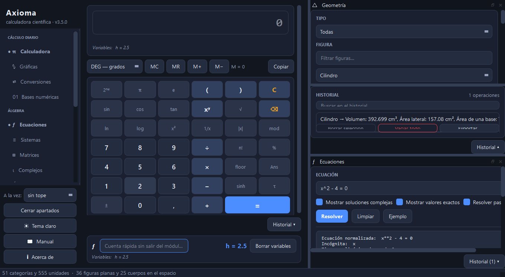

</div>

---

## Qué incluye

### Cálculo diario

| Módulo | Qué hace |
|--------|----------|
| **Calculadora** | Científica completa: trigonometría directa e inversa, hiperbólicas, logaritmos, factorial, memoria, grados/radianes/gradianes, variables propias y vista previa mientras se escribe. Además **opera con unidades**: `5 km + 300 m` da `5.3 km`. |
| **Gráficas** | Hasta cuatro funciones a la vez, con cortes, extremos y límites calculados automáticamente. Zoom, arrastre y exportación de la imagen. |
| **Conversiones** | **51 magnitudes y 555 unidades**, con buscador y equivalencias simultáneas en toda la categoría. |
| **Bases numéricas** | Bases 2 a 36 con signo, decimales y prefijos `0x`/`0b`/`0o`. Complemento a dos y operaciones bit a bit. |

### Álgebra

| Módulo | Qué hace |
|--------|----------|
| **Ecuaciones** | Ecuaciones **e inecuaciones** de una incógnita, **resueltas paso a paso**. Soluciones exactas y aproximadas, raíces complejas, factorización y gráfica con el conjunto solución sombreado. |
| **Sistemas** | Hasta 10 ecuaciones lineales, con el **método de Gauss paso a paso**. Clasificación por Rouché-Frobenius, matriz ampliada, rangos y determinante. |
| **Matrices** | Determinante, inversa, pseudoinversa, rango, traza, potencias, Gauss-Jordan, autovalores y autovectores, diagonalización, núcleo, imagen, LU y resolución de A·x = b. |
| **Complejos** | Formas binómica, polar, trigonométrica y exponencial. Aritmética, De Moivre, raíces n-ésimas y plano de Argand. |

### Análisis

| Módulo | Qué hace |
|--------|----------|
| **Cálculo** | Derivadas e integrales **paso a paso, nombrando cada regla aplicada**. Integrales definidas, límites laterales, series de Taylor, extremos y análisis completo de funciones. |
| **Ec. diferenciales** | EDOs de cualquier orden con notación `y'` o `dy/dx`. Clasifica el tipo, da la solución general o particular, **la comprueba sustituyéndola** y dibuja el **campo de direcciones**. También sistemas de EDOs y el método de Laplace. |
| **Transformadas** | Laplace directa e inversa, Fourier, y **series de Fourier** con la gráfica que muestra cómo la serie se acerca a la función. Incluye la tabla de transformadas usuales. |
| **Numérico** | Raíces (bisección, Newton-Raphson, secante), integración (trapecio, Simpson), interpolación (Lagrange, diferencias divididas) y EDOs (Euler, Runge-Kutta 4). Todo con la **tabla de iteraciones** y la gráfica de convergencia. |

### Datos y geometría

| Módulo | Qué hace |
|--------|----------|
| **Estadística** | Descriptiva completa con detección de atípicos, tabla de frecuencias, regresión lineal y distribuciones normal, binomial y de Poisson. Histograma, diagrama de caja y ojiva. |
| **Ajuste de curvas** | Prueba los modelos lineal, cuadrático, cúbico, exponencial, logarítmico y potencial, **compara su r² y recomienda el mejor**. Con predicción y aviso cuando el ajuste se hace linealizando. |
| **Geometría** | **61 figuras**: 36 planas y 25 cuerpos, con vista previa 2D/3D y las fórmulas aplicadas. Incluye **cálculo inverso**: «el área vale 50, ¿cuánto mide el lado?». |
| **Combinatoria** | Factorial, combinaciones, permutaciones, variaciones, doble factorial, subfactorial, números de Catalan, función gamma y aproximación de Stirling. |

### Una sola pantalla

**No se cambia de página.** La calculadora ocupa el centro y no se cierra; los
demás apartados se enganchan a su alrededor pulsando su nombre en el lateral,
los que se quieran a la vez. Se colocan arrastrándolos por su título: a un lado,
encima, debajo, apilados en pestañas o sueltos fuera de la ventana. Para resolver
un problema de trigonometría hay que ver la figura, la ecuación y la calculadora
al mismo tiempo, no una detrás de otra.

Cerrar un apartado no borra lo escrito, y la disposición se guarda: la
aplicación vuelve a abrirse tal como se dejó.

**Lo que sale en un apartado se usa en los demás.** Doble clic en un resultado
y se guarda como variable compartida, con su valor exacto. Calcule el volumen de
un cilindro en Geometría, guárdelo como `volumen`, y escriba `x^2 = volumen` en
Ecuaciones: se resuelve. En las salidas de texto se selecciona el número y se usa
el menú del botón derecho.

**Una barra de cálculo bajo la calculadora.** Si necesita saber cuánto vale
`5*sin(30)` sin abandonar lo que está haciendo, lo escribe ahí. Lo que calcula
**va al historial del apartado en el que está**, no a un cajón común, y las
**variables se comparten**: defina `h = 5*sin(30)` y podrá usar `h` en los campos
de cualquier apartado.

**Los campos aceptan más que números.** Escriba `sqrt(16)`, una variable, o una
unidad. En Geometría se pueden **mezclar**: radio `5 cm` y altura `50 mm` dan
**392,699 cm³**, no «392,699 u³».

Cada apartado lleva su propio historial, plegado hasta que se pide, con
búsqueda, restauración con doble clic y exportación a CSV o TXT.

### Paso a paso

Axioma no se limita a dar el resultado: en ecuaciones, sistemas, derivadas e
integrales muestra el desarrollo completo, nombrando la regla aplicada en cada
punto y comprobando el resultado al final.

```
1. Es una ecuación de segundo grado
      Tiene la forma a·x² + b·x + c = 0, con a = 1, b = -5 y c = 6.
2. Se puede factorizar
      (x - 3)*(x - 2) = 0
3. Calculamos el discriminante
      Δ = (-5)² − 4·(1)·(6) = 1
4. Qué significa el discriminante
      Δ > 0: hay dos soluciones reales distintas.
5. Aplicamos la fórmula
      x = (5 ± √1) / 2
6. Comprobación
      0 = 0, correcto
```

---

## En el móvil y en el navegador

**[Abrir Axioma en el navegador →](https://erlanders177.github.io/Axioma/)**

Funciona en el móvil y en el ordenador, sin instalar nada. En el teléfono, el
menú del navegador ofrece «Añadir a la pantalla de inicio» y queda como una
aplicación más.

La primera visita descarga Python entero (unos segundos); a partir de ahí
**funciona sin conexión**. No es una reescritura: dentro del navegador corre el
mismo `src/core` que la versión de escritorio, con
[Pyodide](https://pyodide.org/), así que los resultados son los mismos por
construcción.

<table>
<tr>
<td width="38%">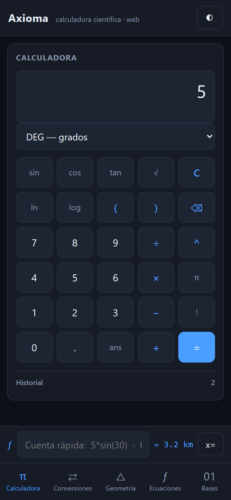<br><sub><b>Móvil</b> — un apartado cada vez, menú abajo</sub></td>
<td width="62%">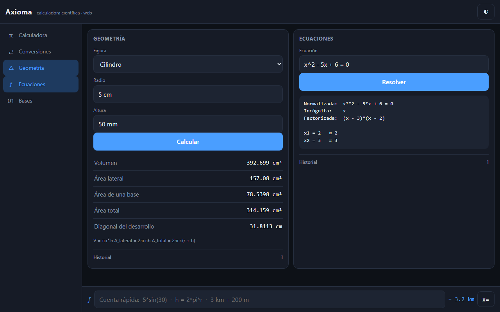<br><sub><b>Ordenador</b> — varios apartados a la vez</sub></td>
</tr>
</table>

En la web hay siete apartados: calculadora, conversiones, geometría, ecuaciones,
cálculo, combinatoria y bases. Los otros nueve, de momento, sólo en la
aplicación de escritorio.

```bash
python tools/preparar_web.py            # empaqueta src/core para el navegador
python -m http.server -d web            # y se abre http://localhost:8000
```

---

## Instalación

### Windows: descargar y usar

Descargue `Axioma.exe` de la [última versión](https://github.com/erlanders177/Axioma/releases/latest)
y ejecútelo. No necesita instalar nada más.

> Windows SmartScreen puede avisar de que el programa no está firmado: el
> certificado de firma es de pago y este proyecto no lo tiene. Pulse
> *Más información → Ejecutar de todas formas*.

### Desde el código fuente

```bash
git clone https://github.com/erlanders177/Axioma.git
cd Axioma
pip install -r requirements.txt
python main.py
```

Requiere **Python 3.10 o superior**. Funciona en Windows, macOS y Linux.

Para abrirlo **con doble clic** en lugar de desde la terminal, use
`Axioma.pyw`: la extensión `.pyw` hace que Windows lo ejecute con `pythonw.exe`
y la aplicación arranca sin la ventana negra de consola detrás.

### Acceso directo en el escritorio

```bash
python tools/crear_acceso_directo.py
```

Crea un acceso directo con el icono de la aplicación. Apunta al ejecutable de
`dist/` si lo ha generado, y si no al lanzador `Axioma.pyw`.

### Generar el ejecutable

```bash
pip install pyinstaller
python tools/generar_icono.py    # sólo si cambia el icono
pyinstaller Axioma.spec
```

El resultado queda en `dist/Axioma.exe` (unos 70 MB). Esa carpeta **no está en
el repositorio**: los ejecutables se publican en
[Releases](https://github.com/erlanders177/Axioma/releases), no en el control de
versiones.

---

## Capturas

<table>
<tr>
<td width="50%">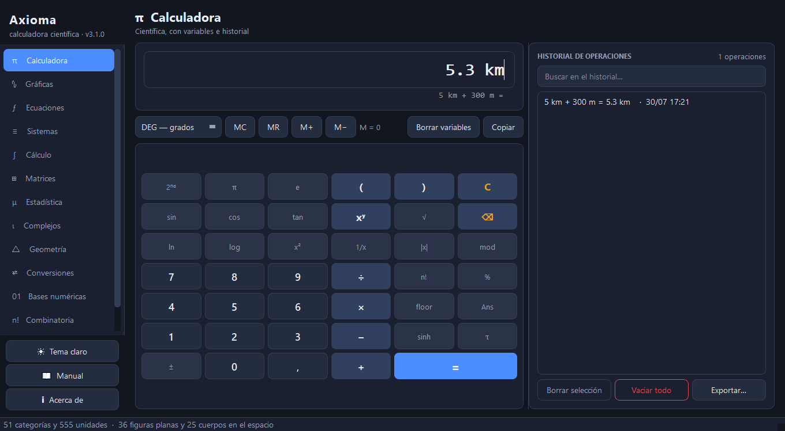<br><sub><b>Calculadora</b> — variables, memoria y vista previa</sub></td>
<td width="50%">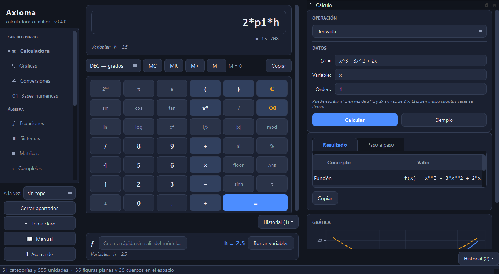<br><sub><b>Cálculo</b> — integral definida con el área sombreada</sub></td>
</tr>
<tr>
<td>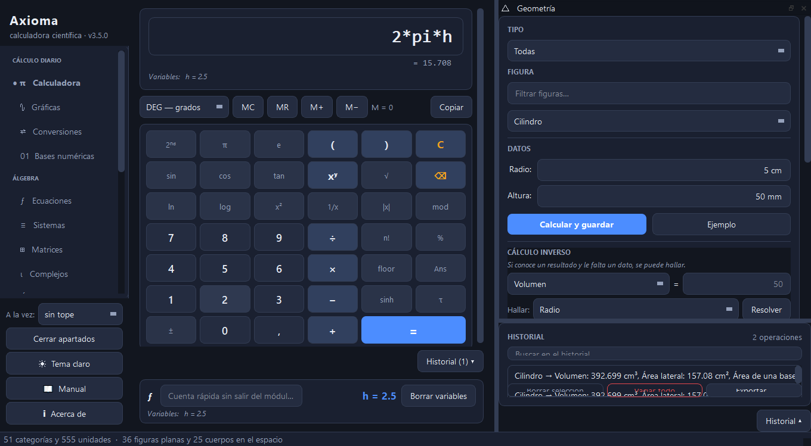<br><sub><b>Geometría</b> — 61 figuras con vista previa 3D</sub></td>
<td>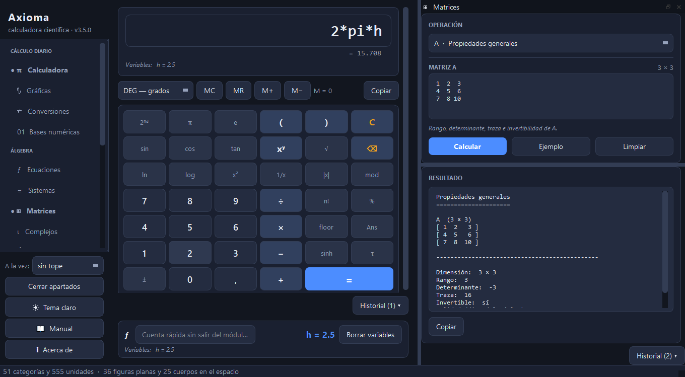<br><sub><b>Matrices</b> — autovalores y diagonalización</sub></td>
</tr>
<tr>
<td>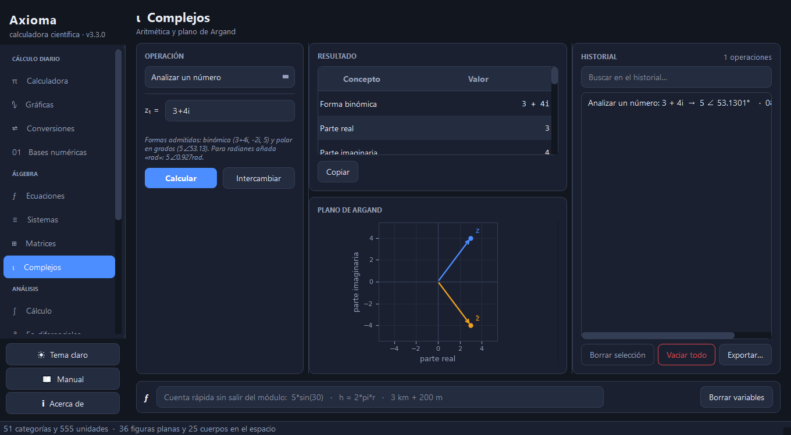<br><sub><b>Complejos</b> — raíces n-ésimas en el plano de Argand</sub></td>
<td>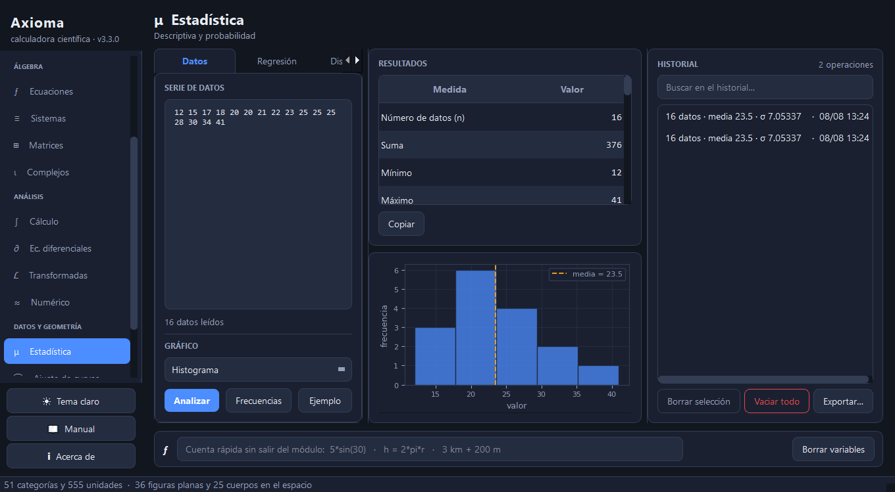<br><sub><b>Estadística</b> — descriptiva e histograma</sub></td>
</tr>
<tr>
<td>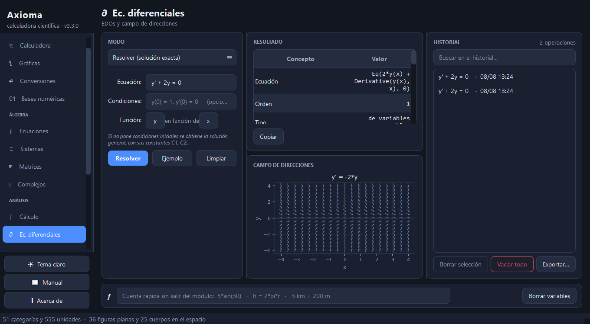<br><sub><b>Ec. diferenciales</b> — campo de direcciones</sub></td>
<td>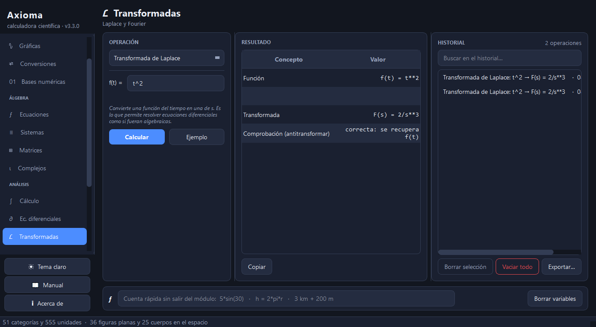<br><sub><b>Transformadas</b> — serie de Fourier y su gráfica</sub></td>
</tr>
<tr>
<td>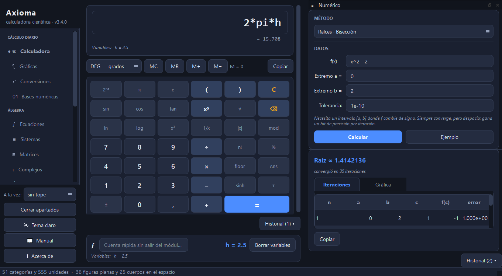<br><sub><b>Numérico</b> — tabla de iteraciones</sub></td>
<td>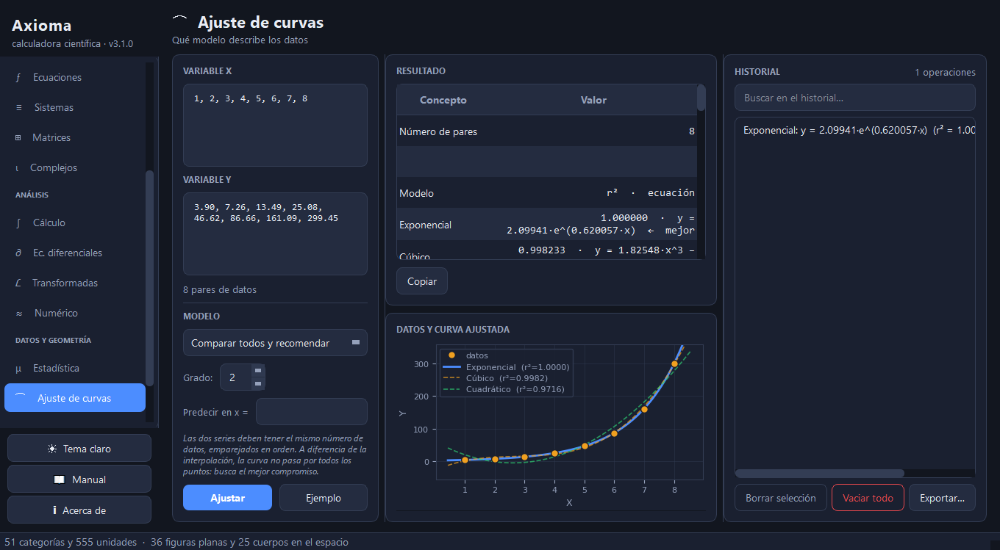<br><sub><b>Ajuste de curvas</b> — compara modelos y recomienda</sub></td>
</tr>
<tr>
<td>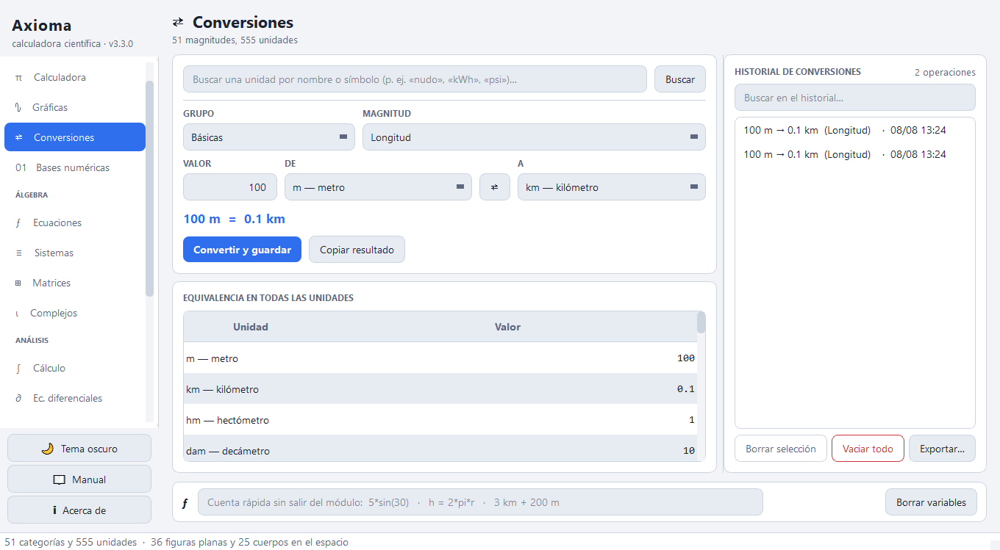<br><sub><b>Conversiones</b> — 555 unidades (tema claro)</sub></td>
<td>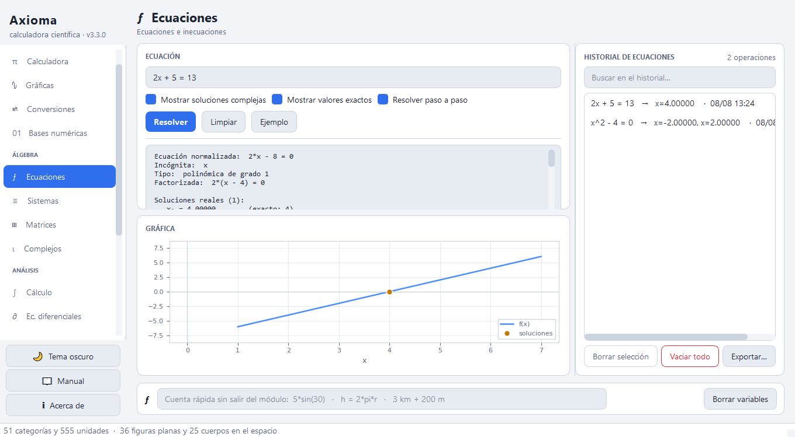<br><sub><b>Ecuaciones</b> — soluciones exactas y gráfica</sub></td>
</tr>
</table>

Temas claro y oscuro, intercambiables con <kbd>Ctrl</kbd>+<kbd>T</kbd>.

---

## Atajos

| Atajo | Acción |
|-------|--------|
| <kbd>Ctrl</kbd>+<kbd>1</kbd>…<kbd>9</kbd> | Abrir uno de los nueve primeros apartados |
| <kbd>Ctrl</kbd>+<kbd>W</kbd> | Cerrar el apartado en uso |
| <kbd>Ctrl</kbd>+<kbd>T</kbd> | Cambiar de tema |
| <kbd>F1</kbd> | Abrir el manual |
| <kbd>Intro</kbd> | Calcular en el apartado activo |
| <kbd>Esc</kbd> | Limpiar la calculadora |
| <kbd>Ctrl</kbd>+<kbd>Espacio</kbd> | Ir a la barra de cálculo |

El manual completo está en [`docs/manual_usuario.html`](docs/manual_usuario.html).

---

## Estructura

```
Axioma/
├── main.py                     punto de entrada
├── Axioma.pyw                  lanzador de doble clic (sin consola)
├── Axioma.spec                 receta de PyInstaller
├── requirements.txt
├── assets/                     icono de la aplicación
├── tools/
│   ├── generar_icono.py        regenera el icono de forma reproducible
│   ├── preparar_web.py         empaqueta src/core para el navegador
│   └── crear_acceso_directo.py acceso directo en el escritorio
├── web/                        la misma calculadora en el navegador
│   ├── index.html
│   ├── app.js                  interfaz; no calcula nada
│   ├── estilo.css              adaptable: móvil y ordenador
│   ├── puente.py               traduce entre el núcleo y la interfaz
│   ├── nucleo.json             copia de src/core (generada)
│   └── sw.js                   caché para funcionar sin conexión
├── docs/
│   ├── manual_usuario.html     manual (F1 desde la aplicación)
│   └── capturas/
├── src/
│   ├── core/                   lógica pura, sin dependencia de la interfaz
│   │   ├── evaluador.py        evaluador de expresiones con lista blanca (AST)
│   │   ├── simbolico.py        base común de sympy, con filtrado de entrada
│   │   ├── calculo.py          derivadas, integrales, límites y series
│   │   ├── edo.py              ecuaciones diferenciales
│   │   ├── numerico.py         métodos aproximados
│   │   ├── transformadas.py    Laplace y Fourier
│   │   ├── ajuste.py           ajuste de curvas
│   │   ├── pasos.py            resolución paso a paso
│   │   ├── matrices.py         álgebra lineal
│   │   ├── estadistica.py      descriptiva, regresión y distribuciones
│   │   ├── complejos.py        aritmética compleja y forma polar
│   │   ├── unidades.py         51 magnitudes, 555 unidades
│   │   ├── magnitudes.py       aritmética con unidades (5 km + 300 m)
│   │   ├── variables.py        variables compartidas entre módulos
│   │   ├── figuras.py          61 figuras geométricas y cálculo inverso
│   │   ├── bases.py            bases 2–36 y operaciones bit a bit
│   │   ├── historial.py        persistencia del historial
│   │   ├── config.py           preferencias del usuario
│   │   ├── formato.py          presentación de números
│   │   └── rutas.py            rutas de datos y recursos
│   └── ui/                     interfaz (PyQt5)
│       ├── ventana_principal.py
│       ├── panel_*.py          un panel por módulo
│       ├── apartado.py        un módulo con su historial, encajable
│       ├── usar_resultado.py  llevar un resultado de un apartado a otro
│       ├── barra_calculo.py    barra de cálculo bajo la calculadora
│       ├── grafica.py          lienzo de matplotlib compartido
│       ├── visualizador.py     dibujo 2D/3D de figuras
│       ├── comunes.py          widgets compartidos
│       └── tema.py             temas claro y oscuro
└── tests/
    ├── test_nucleo.py          lógica de cálculo
    ├── test_extras.py          unidades, geometría inversa y paso a paso
    ├── test_avanzado.py        EDOs, numérico, transformadas y ajuste
    ├── test_empaquetado.py     comprobaciones sobre el .spec
    └── test_interfaz.py        los dieciséis paneles, sin abrir ventana
```

`src/core` no importa nada de PyQt: la lógica de cálculo se puede probar y
reutilizar sin abrir una ventana.

---

## Pruebas

```bash
pip install pytest
python -m pytest tests/ -q
```

523 pruebas: conversiones contra valores de referencia, ida y vuelta de las 555
unidades, las 61 figuras contra resultados conocidos, entradas maliciosas
bloqueadas en el evaluador, resultados de libro comprobados (la serie de Fourier
de x, la precisión relativa de Euler frente a Runge-Kutta) y los dieciséis
módulos de la interfaz ejercitados de extremo a extremo con la plataforma
*offscreen* de Qt.

Se ejecutan automáticamente en cada `push` sobre Windows y Linux, con Python
3.10, 3.12 y 3.13.

---

## Dónde se guardan los datos

El historial, la configuración y el registro de errores van al perfil del
usuario, **no** junto al ejecutable:

| Sistema | Ruta |
|---------|------|
| Windows | `%APPDATA%\Axioma` |
| macOS   | `~/Library/Application Support/Axioma` |
| Linux   | `~/.local/share/Axioma` |

Así la aplicación funciona igual esté instalada donde esté, y desinstalarla no
borra el historial. La ruta exacta aparece en *Acerca de*.

---

## Seguridad

La aplicación evalúa expresiones que escribe el usuario, así que eso se trata
con cuidado:

- **La calculadora no usa `eval()`.** Las expresiones se compilan a un árbol de
  sintaxis (`ast`) y se recorren permitiendo sólo números, operadores
  aritméticos y una lista blanca de funciones. No hay acceso a atributos,
  nombres externos ni llamadas dinámicas.
- **La entrada a sympy se filtra antes de analizarla** (`src/core/simbolico.py`):
  se rechazan los subrayados dobles, el acceso a atributos y cualquier función
  que no esté en la lista blanca.
- Hay pruebas específicas que comprueban que `__import__('os')`, `open(...)` y
  similares se rechazan con un mensaje, no se ejecutan.

---

## Licencia

Axioma se distribuye bajo la
[PolyForm Noncommercial License 1.0.0](LICENSE).

> Required Notice: Copyright 2026 Aarón Aranda Torrijos
> (https://github.com/erlanders177/Axioma)

**Puede usarlo libremente** cualquier persona para uso personal, estudio,
investigación, proyectos de aficionado o docencia, y cualquier organización sin
ánimo de lucro, centro educativo, organismo público de investigación o
administración pública. Puede además modificarlo y redistribuirlo dentro de esos
usos, siempre que conserve este aviso.

**Lo que no permite** es el uso comercial: no puede emplearse para generar
ingresos ni integrarse en un producto o servicio de pago.

### ¿Quiere usarlo comercialmente?

La idea no es cerrar la puerta, es no regalar el trabajo a quien va a lucrarse
con él. Si quiere usar Axioma en un producto o servicio comercial, escriba a
**aaron.aranda.t@gmail.com** y acordamos una licencia comercial. Estoy abierto a
ello.

<sub>Nota: PolyForm Noncommercial es una licencia <i>source-available</i>, no una
licencia de código abierto aprobada por la OSI, porque restringe el uso
comercial. GitHub no la muestra en el panel lateral de licencia por ese motivo.</sub>

---

<div align="center">
<sub>Desarrollado por <b>Aarón Aranda Torrijos</b> (<a href="https://github.com/erlanders177">@erlanders177</a>) · <a href="mailto:aaron.aranda.t@gmail.com">aaron.aranda.t@gmail.com</a></sub>
</div>
