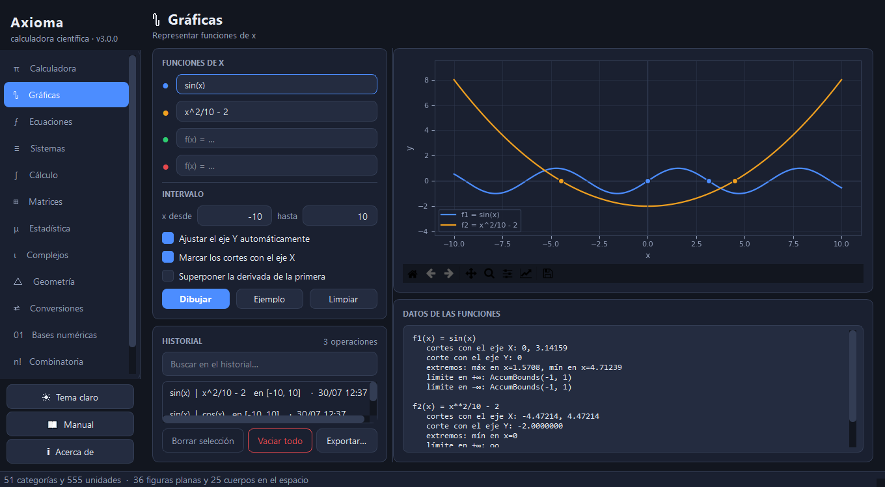

<div align="center">

# Axioma

**Calculadora científica multifunción de escritorio.**
Doce módulos en una sola ventana, en español, sin conexión a internet.

[](https://www.python.org/)
[](https://pypi.org/project/PyQt5/)
[](tests/)
[](LICENSE)



</div>

---

## Qué incluye

| Módulo | Qué hace |
|--------|----------|
| **Calculadora** | Científica completa: trigonometría directa e inversa, hiperbólicas, logaritmos, factorial, memoria, grados/radianes/gradianes, variables propias y vista previa del resultado mientras se escribe. |
| **Gráficas** | Hasta cuatro funciones a la vez, con cortes, extremos y límites calculados automáticamente. Zoom, arrastre y exportación de la imagen. |
| **Ecuaciones** | Ecuaciones **e inecuaciones** de una incógnita. Soluciones exactas y aproximadas, raíces complejas, factorización y gráfica con el conjunto solución sombreado. |
| **Sistemas** | Hasta 10 ecuaciones lineales. Clasificación por Rouché-Frobenius, matriz ampliada, rangos y determinante. |
| **Cálculo** | Derivadas de cualquier orden, integrales indefinidas y definidas, límites (incluidos los laterales), series de Taylor, extremos y análisis completo de funciones. |
| **Matrices** | Determinante, inversa, pseudoinversa, rango, traza, potencias, Gauss-Jordan, autovalores y autovectores, diagonalización, núcleo, imagen, LU y resolución de A·x = b. |
| **Estadística** | Descriptiva completa con detección de atípicos, tabla de frecuencias, regresión lineal y distribuciones normal, binomial y de Poisson. Histograma, diagrama de caja y ojiva. |
| **Complejos** | Formas binómica, polar, trigonométrica y exponencial. Aritmética, De Moivre, raíces n-ésimas y plano de Argand. |
| **Geometría** | **61 figuras**: 36 planas y 25 cuerpos en el espacio, con vista previa 2D/3D y las fórmulas aplicadas. |
| **Conversiones** | **51 magnitudes y 555 unidades**, con buscador y equivalencias simultáneas en toda la categoría. |
| **Bases numéricas** | Bases 2 a 36 con signo, decimales y prefijos `0x`/`0b`/`0o`. Complemento a dos y operaciones bit a bit. |
| **Combinatoria** | Factorial, combinaciones, permutaciones, variaciones, doble factorial, subfactorial, números de Catalan, función gamma y aproximación de Stirling. |

Todos los módulos guardan su propio historial, con búsqueda, restauración con doble clic y exportación a CSV o TXT.

---

## Instalación

```bash
git clone https://github.com/erlanders177/Axioma.git
cd Axioma
pip install -r requirements.txt
python main.py
```

Requiere **Python 3.10 o superior**. Funciona en Windows, macOS y Linux.

### Generar el ejecutable

```bash
pip install pyinstaller
pyinstaller Axioma.spec
```

El resultado queda en `dist/Axioma.exe`.

---

## Capturas

<table>
<tr>
<td width="50%"><br><sub><b>Calculadora</b> — variables, memoria y vista previa</sub></td>
<td width="50%"><br><sub><b>Cálculo</b> — integral definida con el área sombreada</sub></td>
</tr>
<tr>
<td><br><sub><b>Geometría</b> — 61 figuras con vista previa 3D</sub></td>
<td><br><sub><b>Matrices</b> — autovalores y diagonalización</sub></td>
</tr>
<tr>
<td><br><sub><b>Complejos</b> — raíces n-ésimas en el plano de Argand</sub></td>
<td><br><sub><b>Estadística</b> — descriptiva e histograma</sub></td>
</tr>
<tr>
<td><br><sub><b>Conversiones</b> — 555 unidades (tema claro)</sub></td>
<td><br><sub><b>Ecuaciones</b> — soluciones exactas y gráfica</sub></td>
</tr>
</table>

Temas claro y oscuro, intercambiables con <kbd>Ctrl</kbd>+<kbd>T</kbd>.

---

## Atajos

| Atajo | Acción |
|-------|--------|
| <kbd>Ctrl</kbd>+<kbd>1</kbd>…<kbd>9</kbd> | Ir a un módulo |
| <kbd>Ctrl</kbd>+<kbd>T</kbd> | Cambiar de tema |
| <kbd>F1</kbd> | Abrir el manual |
| <kbd>Intro</kbd> | Calcular en el módulo activo |
| <kbd>Esc</kbd> | Limpiar la calculadora |

El manual completo está en [`docs/manual_usuario.html`](docs/manual_usuario.html).

---

## Estructura

```
Axioma/
├── main.py                     punto de entrada
├── Axioma.spec                 receta de PyInstaller
├── requirements.txt
├── docs/
│   ├── manual_usuario.html     manual (F1 desde la aplicación)
│   └── capturas/
├── src/
│   ├── core/                   lógica pura, sin dependencia de la interfaz
│   │   ├── evaluador.py        evaluador de expresiones con lista blanca (AST)
│   │   ├── simbolico.py        base común de sympy, con filtrado de entrada
│   │   ├── calculo.py          derivadas, integrales, límites y series
│   │   ├── matrices.py         álgebra lineal
│   │   ├── estadistica.py      descriptiva, regresión y distribuciones
│   │   ├── complejos.py        aritmética compleja y forma polar
│   │   ├── unidades.py         51 magnitudes, 555 unidades
│   │   ├── figuras.py          61 figuras geométricas
│   │   ├── bases.py            bases 2–36 y operaciones bit a bit
│   │   ├── historial.py        persistencia del historial
│   │   ├── config.py           preferencias del usuario
│   │   ├── formato.py          presentación de números
│   │   └── rutas.py            rutas de datos y recursos
│   └── ui/                     interfaz (PyQt5)
│       ├── ventana_principal.py
│       ├── panel_*.py          un panel por módulo
│       ├── grafica.py          lienzo de matplotlib compartido
│       ├── visualizador.py     dibujo 2D/3D de figuras
│       ├── comunes.py          widgets compartidos
│       └── tema.py             temas claro y oscuro
└── tests/
    ├── test_nucleo.py          183 pruebas de la lógica de cálculo
    └── test_interfaz.py        101 pruebas de la interfaz (sin ventana)
```

`src/core` no importa nada de PyQt: la lógica de cálculo se puede probar y
reutilizar sin abrir una ventana.

---

## Pruebas

```bash
pip install pytest
python -m pytest tests/ -q
```

284 pruebas: conversiones contra valores de referencia, ida y vuelta de las 555
unidades, las 61 figuras contra resultados conocidos, entradas maliciosas
bloqueadas en el evaluador, y los doce módulos de la interfaz ejercitados de
extremo a extremo con la plataforma *offscreen* de Qt.

---

## Dónde se guardan los datos

El historial, la configuración y el registro de errores van al perfil del
usuario, **no** junto al ejecutable:

| Sistema | Ruta |
|---------|------|
| Windows | `%APPDATA%\Axioma` |
| macOS   | `~/Library/Application Support/Axioma` |
| Linux   | `~/.local/share/Axioma` |

Así la aplicación funciona igual esté instalada donde esté, y desinstalarla no
borra el historial. La ruta exacta aparece en *Acerca de*.

---

## Seguridad

La aplicación evalúa expresiones que escribe el usuario, así que eso se trata
con cuidado:

- **La calculadora no usa `eval()`.** Las expresiones se compilan a un árbol de
  sintaxis (`ast`) y se recorren permitiendo sólo números, operadores
  aritméticos y una lista blanca de funciones. No hay acceso a atributos,
  nombres externos ni llamadas dinámicas.
- **La entrada a sympy se filtra antes de analizarla** (`src/core/simbolico.py`):
  se rechazan los subrayados dobles, el acceso a atributos y cualquier función
  que no esté en la lista blanca.
- Hay pruebas específicas que comprueban que `__import__('os')`, `open(...)` y
  similares se rechazan con un mensaje, no se ejecutan.

---

## Licencia

[PolyForm Noncommercial License 1.0.0](LICENSE) — libre para uso personal,
educativo, de investigación y de organizaciones sin ánimo de lucro. El uso
comercial requiere permiso del autor.

Es una licencia *source-available*, no una licencia de código abierto aprobada
por la OSI, porque restringe el uso comercial.

---

<div align="center">
<sub>Desarrollado por <b>Erlanders</b> · <a href="mailto:3rlanderse34@gmail.com">3rlanderse34@gmail.com</a></sub>
</div>
